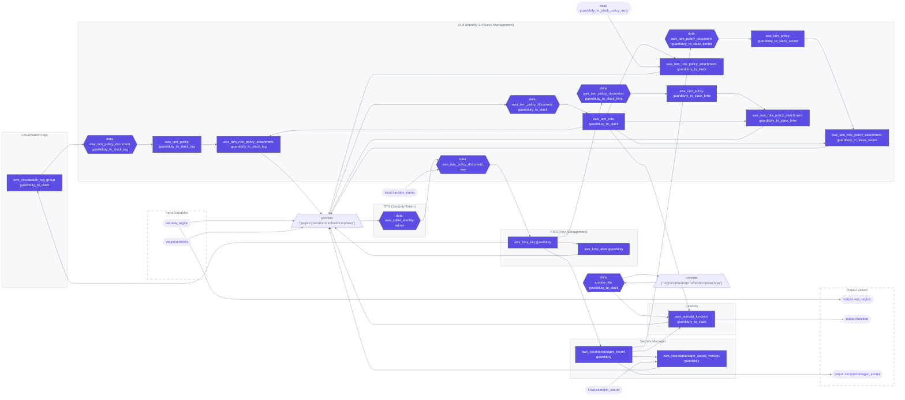

# terraform-aws-guardduty-organization

## lambda

```mermaid
%%tfmermaid:lambda
%%{init:{"theme":"default","themeVariables":{"lineColor":"#6f7682","textColor":"#6f7682"}}}%%
flowchart LR
classDef r fill:#5c4ee5,stroke:#444,color:#fff
classDef v fill:#eeedfc,stroke:#eeedfc,color:#5c4ee5
classDef ms fill:none,stroke:#dce0e6,stroke-width:2px
classDef vs fill:none,stroke:#dce0e6,stroke-width:4px,stroke-dasharray:10
classDef ps fill:none,stroke:none
classDef cs fill:#f7f8fa,stroke:#dce0e6,stroke-width:2px
subgraph "n0"["CloudWatch Logs"]
n1["aws_cloudwatch_log_group.<br/>guardduty_to_slack"]:::r
end
class n0 cs
subgraph "n2"["IAM (Identity & Access Management)"]
n3["aws_iam_policy.<br/>guardduty_to_slack_kms"]:::r
n4["aws_iam_policy.<br/>guardduty_to_slack_log"]:::r
n5["aws_iam_policy.<br/>guardduty_to_slack_secret"]:::r
n6["aws_iam_role.<br/>guardduty_to_slack"]:::r
n7["aws_iam_role_policy_attachment.<br/>guardduty_to_slack"]:::r
n8["aws_iam_role_policy_attachment.<br/>guardduty_to_slack_kms"]:::r
n9["aws_iam_role_policy_attachment.<br/>guardduty_to_slack_log"]:::r
na["aws_iam_role_policy_attachment.<br/>guardduty_to_slack_secret"]:::r
nb{{"data.<br/>aws_iam_policy_document.<br/>guardduty_to_slack"}}:::r
nc{{"data.<br/>aws_iam_policy_document.<br/>guardduty_to_slack_kms"}}:::r
nd{{"data.<br/>aws_iam_policy_document.<br/>guardduty_to_slack_log"}}:::r
ne{{"data.<br/>aws_iam_policy_document.<br/>guardduty_to_slack_secret"}}:::r
nf{{"data.<br/>aws_iam_policy_document.<br/>key"}}:::r
end
class n2 cs
subgraph "ng"["KMS (Key Management)"]
nh["aws_kms_alias.guardduty"]:::r
ni["aws_kms_key.guardduty"]:::r
end
class ng cs
subgraph "nj"["Lambda"]
nk["aws_lambda_function.<br/>guardduty_to_slack"]:::r
end
class nj cs
subgraph "nl"["Secrets Manager"]
nm["aws_secretsmanager_secret.<br/>guardduty"]:::r
nn["aws_secretsmanager_secret_version.<br/>guardduty"]:::r
end
class nl cs
no{{"data.<br/>archive_file.<br/>guardduty_to_slack"}}:::r
subgraph "np"["STS (Security Token)"]
nq{{"data.<br/>aws_caller_identity.<br/>admin"}}:::r
end
class np cs
nr[/"provider<br/>[&quot;registry.terraform.io/hashicorp/archive&quot;]"\]
ns[/"provider<br/>[&quot;registry.terraform.io/hashicorp/aws&quot;]"\]
subgraph "nt"["Input Variables"]
nu(["var.aws_region"]):::v
nv(["var.parameters"]):::v
end
class nt vs
nw(["local.<br/>guardduty_to_slack_policy_arns"]):::v
nx(["local.example_secret"]):::v
ny(["local.function_name"]):::v
subgraph "nz"["Output Values"]
n10(["output.aws_region"]):::v
n11(["output.function"]):::v
n12(["output.secretsmanager_secret"]):::v
end
class nz vs
ni-->n1
nc-->n3
nd-->n4
ne-->n5
nb-->n6
n6-->n7
nw-->n7
n3-->n8
n6-->n8
n4-->n9
n6-->n9
n5-->na
n6-->na
ni-->nh
nf-->ni
n6-->nk
nm-->nk
no-->nk
ni-->nm
nm-->nn
nx-->nn
nr-->no
ns-->nq
ns-->nb
ni-->nc
n1-->nd
nm-->ne
nq-->nf
ny-->nf
nu--->n10
nk--->n11
nm--->n12
no-->nr
n7-->ns
n8-->ns
n9-->ns
na-->ns
nh-->ns
nk-->ns
nn-->ns
nu--->ns
nv--->ns
```
